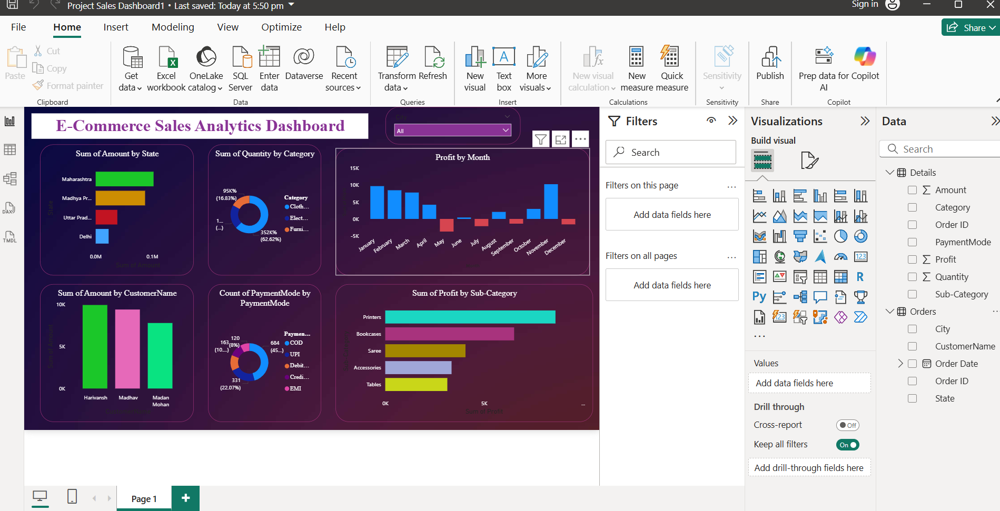

# E-Commerce-Sales-Analytics-Dashboard

## 📸 Dashboard Preview  
  
## How to Use
1. **Download** the `.pbix` file  
2. **Open** in Power BI Desktop   
3. **Connect** to your dataset or use the sample data  
4. **Explore** filters, slicers, and visuals to gain insights.  
